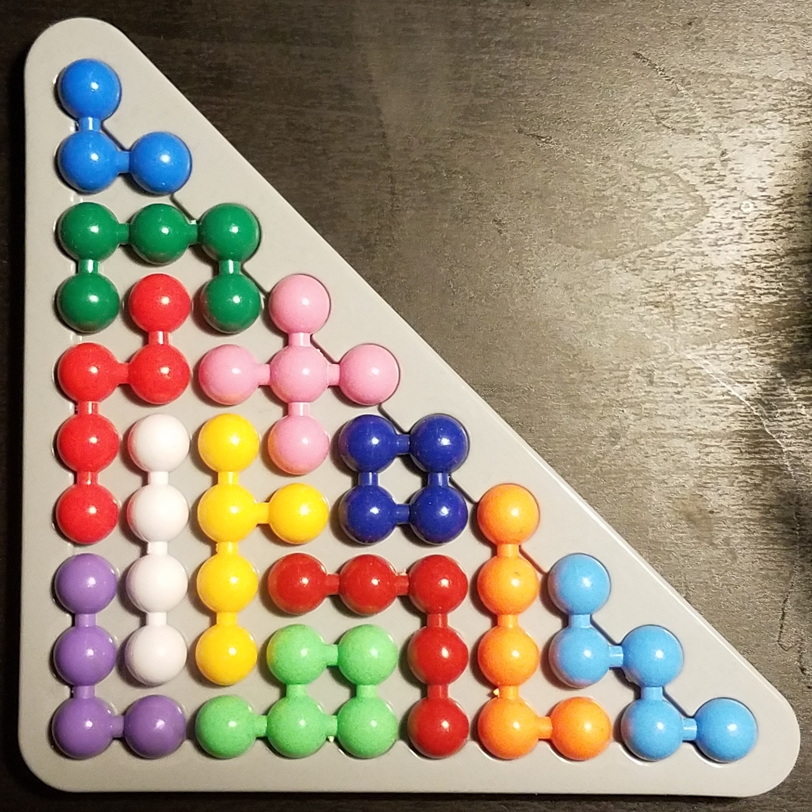

### Daiso Puzzle Solver

This program recursively discovers all solutions to this silly little puzzle from Daiso Japan. It was developed as a _practical_ example of recursive backtracking for my CSE 143 students and admittedly to satisfy my own curiosity. Set PRINT_PROGRESS to 1 to print the board state after each piece is placed, or 0 to print only the solved board states.

